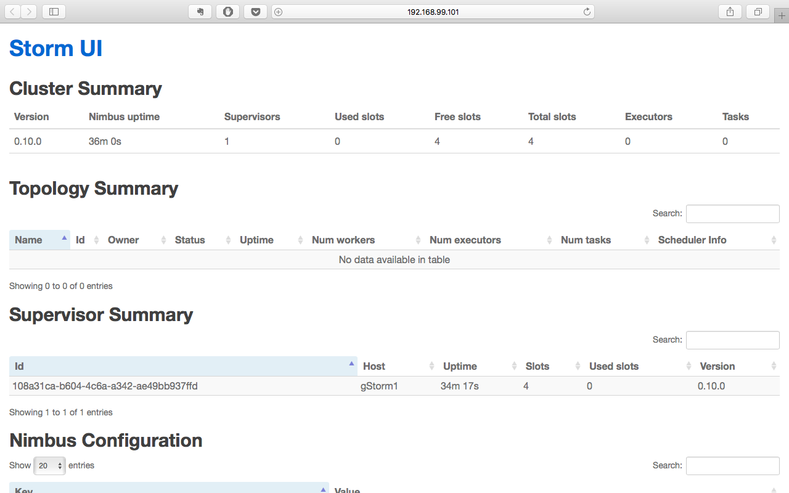

storm installation and configuration
====

*Team member: Wei Gu, Guang Yang*

# Clusters on Virtual Machines (virtualBox in this case)
## Setup VMs and dependencies
create VMs as follows

| Parameters | storm-VM1-master | storm-VM2-slave | storm-VM3-slave |
| ---------- | ---------------- | --------------- | --------------- |
| Name       | storm-VM1-master | storm-VM2-slave | storm-VM3-slave |
| IP address | 192.168.99.101   | 192.168.99.101  | 192.168.99.101  |


- **Basic configurations**
Operating System: Ubuntu-14.04.4-64bit
Ram: 2.5G

- Dependencies
    + JDK 6 or higher installed on all the virtual machines
    + `JAVA_HOME` variable set to the path where JDK is installed
    + Python 2.6.6+ installed on all the virtual machines
    + Root access on all the virtual machines as all the steps should ideally be performed by root user
    + Updated `/etc/hosts` file on both the virtual machines with the IP address of other virtual machines. In my case, this additional line in VM1 hosts file looks like 192.168.99.102 storm-VM2-slave.

- IP address configuration for virtualBox
Create new "host-only networks", and in VM settings add the host-only adapter in network tab. You can change the IP configuration in virtualBox setting. You can check the IP of VMs with `VBoxManage guestproperty enumerate <VM name>` (you need install virtual box guest suit for this command to run)
Also allow all network from VMs

you can clone the VM once you have done for the first one to save time!

## Zookeeper configuration

**attention**
You need to 2n+1 machines in the cluster for ZooKeeper best performance, which allows n machine to fail. The least number of machine needed is three. And you will need ZooKeeper to be installed and configured on every machine.

First step to install Apache ZooKeeper is to download its binaries on both the virtual machines. Apache ZooKeeper can be downloaded from [here](http://zookeeper.apache.org/releases.html).

Once the libraries have been downloaded on the virtual machines, you can extract it to a directory where you would like ZooKeeper to be installed. We will refer this directory as `$ZooKeeper_Base_Dir`. Also add this variable to your environment (`/etc/environment`)

Here is my `zoo.cfg` in `$ZooKeeper_Base_Dir/conf`

``` bash
tickTime=2000

#Replace the value of dataDir with the directory where you would like ZooKeeper to save its data
dataDir=<dataDir>

#Replace the value of dataLogDir with the directory where you would like ZooKeeper to log
dataLogDir=<dataLogDir>

clientPort=2181
initLimit=10
syncLimit=10
server.1=192.168.99.101:2888:3888
server.2=storm-VM2-slave:2888:3888
server.3=storm-VM3-slave:2888:3888
```
**x** in `server.x` denotes the id of node. Each `server.x` row must have unique id. Each server is assigned an id by creating a file named **myid**, one for each server, which resides in that server's data directory, as specified by the configuration file parameter dataDir.

The **myid** file consists of a single line containing only the text of that machine's id. So myid of server 1 would contain the text 1 and nothing else. The id must be unique within the ensemble and should have a value between 1 and 255.

## Strom configuration
First step to install Apache Storm is to download its binaries on both the virtual machines. Apache Storm can be downloaded from [here](https://storm.apache.org/downloads.html).

Once the libraries have been downloaded on the virtual machines, you can extract it to a directory where you would like Apache Storm to be installed. Also create variable `$Storm_Base_Dir` in environment

As you can see in the naming of the VMs, we have one master node, and two worker nodes in this case. Therefore, my storm configuration `storm.yaml` looks like this:

``` bash
storm.zookeeper.servers:
     - "0.0.0.0"

nimbus.host: "0.0.0.0"

storm.local.dir: "<your_storm_local_dir>"
```

Then in the two worker nodes **storm-VM2-slave** and **storm-VM3-slave**, add port configuration for workers on top of the above lines.

``` bash
storm.zookeeper.servers:
     - "0.0.0.0"

nimbus.host: "0.0.0.0"

storm.local.dir: "<your_storm_local_dir>"

supervisor.slots.ports:
    - 6700
    - 6701
    - 6702
    - 6703
```

## Start the cluster
first start ZooKeeper on each VMs with
`sudo $ZooKeeper_Base_Dir/bin/zkServer.sh start`, you can check the status with `sudo $ZooKeeper_Base_Dir/bin/zkServer.sh status`

then start the nimbus on the master node: `$Storm_Base_Dir/bin/storm nimbus`

next start supervisor daemon on each worker node: `$Storm_Base_Dir/bin/storm supervisor`

finally start UI on master node: `$Storm_Base_Dir/bin/storm ui`

Now we can see the storm UI when we visiting master:8080, is this case, which is 192.168.99.101:8080



# Other Methods
## configured VM or container (docker)
It is really easy and handy to use configured VMs like vagrant or new Techniques like Docker to deploy in a robust and easy fashion.

- for vagrant, try https://github.com/ptgoetz/storm-vagrant
- for Docker, https://hub.docker.com/r/fhuz/docker-storm/

## AWS deployment
Cloud computing is more and more used, particularly in production environment. EC2 from AWS is an extremely easy-to-use and easy-to-scale platform. If you're on EC2, the [storm-deploy project](https://github.com/nathanmarz/storm-deploy) can provision, configure, and install a Storm cluster from scratch at just the click of a button.

<br></br>

*Reference*

1. [Setting up Apache ZooKeeper Cluster](http://www.allprogrammingtutorials.com/tutorials/setting-up-apache-zookeeper-cluster.php)
2. [Setting up Apache Storm Cluster](http://www.allprogrammingtutorials.com/tutorials/setting-up-apache-storm-cluster.php)
3. [Apache Storm](http://storm.apache.org/about/deployment.html)
