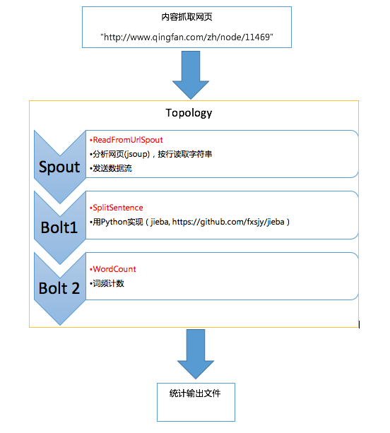
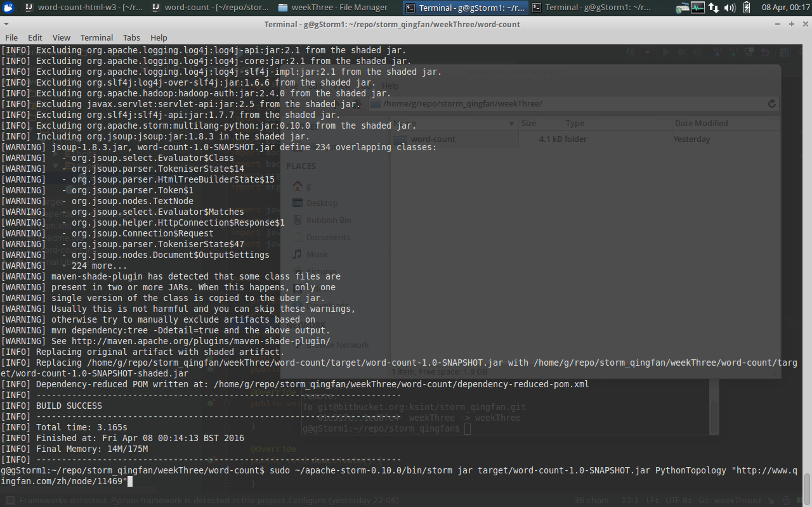
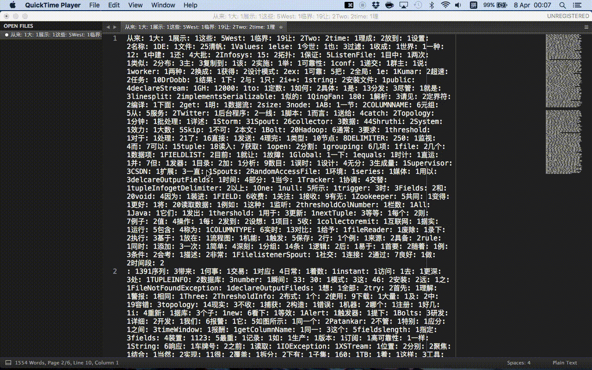

Week Three Project
====

Team Member: 顾炜， 杨光


>任务3:html网页内容的分词处理
>
**任务描述**：
使用Storm实现对html网页新闻的分词处理
使用开源的分词工具（推荐Lucene），结合Storm实现对新闻类网页([html文件](http://www.qingfan.com/zh/node/11469))的分词处理。

>最终输出：

>    1. 形成《使用Storm实现新闻分词处理报告》（包含程序说明，程序流程图，测试说明，结果介绍）
>    2. 利用Storm实现新闻分词程序源代码；

____

目录


- [程序说明](#description)
    - [Topology structure](#topology-structure)
    - [程序结构](#structure)
    - [程序配置](#config)
    - [代码说明](#code)
        - [topology conf change](#topology-conf)
        - [readFromUrlSpout](#eadFromUrlSpout)
        - [分词](#tokenize)
    - [结果介绍](#result)
- [总结与思考](#summary)


____

<a name="description"></a>
# 程序说明
本组在第二周实现了统计一篇文章(纯文本)的词频（统计词语出现的次数），其中简单实现了分词的功能。本周任务为对html文件进行分词处理，只需在第二周的基础上完成以下改进：

1. 请求指定的web地址，得到返回的html
2. 分析html，提取正文，发送数据流
3. 优化分词处理

前两点使用[jsoup](http://jsoup.org/)实现html的请求和parse，最后一点仍然主要使用[jieba](https://github.com/fxsjy/jieba)，也尝试使用其他分词模型。

## Topology Structure


Topology如上图所示，由一个spout和两个bolt构成

`ReadFromUrlSpout`对指定网址请求得到html代码，然后解析出文字内容，按行生成stream
随后`SplitSentence`接受这个stream，用python处理分词，使用了第三方库jieba加上自定义语料库，之后生成word的stream
stream进入`WordCount`，进行计数，结果会在console显示，同时也输出文件。

<a name="structure"></a>
## 程序结构
程序文件结构如下：

```
├── output_sougou.txt
├── output_userdict.txt
├── weekThreeTask.md
└── word-count
    ├── dependency-reduced-pom.xml
    ├── multilang
    │   └── resources
    │       ├── __init__.py
    │       ├── splitsentence.py
    │       ├── storm.py
    │       └── userdict.txt
    ├── pom.xml
    ├── readme.md
    └── src
        └── main
            └── com
                ├── PythonTopology.java
                ├── bolts
                │   ├── SplitSentence.java
                │   └── WordCount.java
                └── spouts
                    └── ReadFromUrlSpout.java

```

<a name="config"></a>
## 程序配置
为了使用jsoup，首先在`pom`文件中加入依赖：

``` xml
    <dependency>
      <!-- jsoup HTML parser library @ http://jsoup.org/ -->
      <groupId>org.jsoup</groupId>
      <artifactId>jsoup</artifactId>
      <version>1.8.3</version>
    </dependency>
```

同时使用maven-shade-plugin，这样可以将jsoup与代码一起打包

``` xml
    <plugin>
        <groupId>org.apache.maven.plugins</groupId>
        <artifactId>maven-shade-plugin</artifactId>
        <version>2.4.3</version>
        <configuration>
            <!-- put your configurations here -->
        </configuration>
        <executions>
            <execution>
                <phase>package</phase>
                <goals>
                    <goal>shade</goal>
                </goals>
                <configuration>
                    <artifactSet>
                        <includes>
                            <include>org.jsoup:jsoup</include>
                        </includes>
                    </artifactSet>
                </configuration>
            </execution>
        </executions>
    </plugin>
```

`mvn package`打包后可以看到一下输出，`jsoup`被包括进了jar


<a name="code"></a>
## 代码说明
### topology conf
由于处理对象是url网址，所以topology的conf与上周相比需要更改，加入`url`配置项。一下配置如果运行，可以通过localmode测试，也可以提交到集群。

``` java
        // configuration
        Config conf = new Config();
        conf.put("url", args[0]);

        // if only one arg, run in local mode
        if (args.length == 1){
            conf.setMaxTaskParallelism(3);

            LocalCluster cluster = new LocalCluster();
            cluster.submitTopology("word-count", conf, builder.createTopology());

            Thread.sleep(10000);

            cluster.shutdown();
        }
        // submit topology to storm
        else {
            conf.setNumWorkers(3);
            StormSubmitter.submitTopologyWithProgressBar(args[1], conf, builder.createTopology());
        }
    }
```

### ReadFromUrlSpout
如同名字体现，这个Spout请求url后得到html代码，然后提取文字，输出数据流。

使用jsoup使得这些变的很简单，首先看open方法：

``` java
public void open(Map conf, TopologyContext context,
                     SpoutOutputCollector collector) {
        try {
            String url = conf.get("url").toString();
            Document doc = Jsoup.connect(url).get();
            String text = doc.body().text();

            this.context = context;
            this.scanner = new Scanner(text);

            // URL url = new URL(conf.get("url").toString());
            // this.context = context;
            // this.inputStreamReader = new InputStreamReader(url.openStream());
        } catch (MalformedURLException e1) {
            e1.printStackTrace();
        } catch (IOException e1) {
            e1.printStackTrace();
        }
        this.collector = collector;
    }
```
从conf中先得到url，然后`Jsoup.connect(url).get()`得到`Document`对象，之后使用`.text()`方法，提取出了文字。

随后使用`Scanner`，传递到`nextTuple()`方法，逐行发送。

``` java
public void nextTuple() {
        /**
         * The nextuple it is called forever, so if we have been readed the file
         * we will wait and then return
         */
        if (completed) {
            try {
                Thread.sleep(1000);
            } catch (InterruptedException e) {
                //Do nothing
            }
            return;
        }

        String str;

        // //Open the reader
        // BufferedReader reader = new BufferedReader(inputStreamReader);
        try{
            //Read all lines
            while(scanner.hasNextLine()){
                /**
                 * By each line emmit a new value with the line as a their
                 */
                // System.out.println(str);
                str = scanner.nextLine();
                this.collector.emit(new Values(str),str);
            }
        }catch(Exception e){
            throw new RuntimeException("Error reading tuple",e);
        }finally{
            completed = true;
        }
    }
```

<a name="tokenize"></a>
### 分词
jieba分词的优势主要在于快速和低占用，其字典本身并不是最强大的，而字典恰恰很大程度上决定了分词的质量。所以优化有两个思路，一是手工加入词汇，二是使用其他分词模型及背后更强大但也占用更多的字典。

手工加入词汇：首先可以直接进行分词，然后观察那些词存在误分，然后加入用户自定义词典`userdict.txt`，也测试了搜狗的字典。

其他的分词模型有[thulac, 清华大学自然语言处理与社会人文计算实验室](http://thulac.thunlp.org/)， [stanford model in nltk, Chinese Natural Language Processing and Speech Processing](http://nlp.stanford.edu/projects/chinese-nlp.shtml)等等。


<a name="result"></a>
## 结果介绍
分词统计的结果仍然输出到txt文件，然后通过sublime text进行换行处理，如下图：


随后可以贴入excel进行排序，得到频率最高的词。

首先是加入了以下手工字典之后

>大数据
清帆
qingfan
分布式
spout
bolt

得到出现大于等于7次的是

| 词组 | 出现次数 | 词组 | 出现次数 | 词组 | 出现次数 | 词组 | 出现次数 |
|-----|---------|-----|---------|------|------|----------|------|
| **分析** | 9 | 并 | 8 | 则 | 7 | 车辆 | 7 |
| null | 9 | 由 | 8 | countincrementAndGet | 7 | 用 | 7 |
| 会 | 9 | 都 | 8 | inputTupleListcollector | 7 | int | 7 |
| 方法 | 9 | 工作 | 8 | 通过 | 7 | 到 | 7 |
| splitAndEmit | 9 | countget | 7 | thresholdValuetoString | 7 | 发射 | 7 |
| frequencyChkOpequals | 8 | 而 | 7 | new | 7 |  |  |
| frequency | 8 | 读入 | 7 | 我们 | 7 |  |  |

很多都是java代码中的变量和方法，以及一些连词，关于内容本身的词则有：分析，节点等

使用搜狗字典之后，得到以下出现大于等于6次的词组：

| 词组 | 出现次数 | 词组 | 出现次数 | 词组 | 出现次数 | 词组 | 出现次数 |
|-----|---------|-----|---------|-----|--------|-------|--------|
| **分析** | 9 | 接收 | 7 | **Hadoop** | 6 | **流**) | 6 |
| 使用 | 9 | 则 | 7 | 读入 | 6 | 会 | 6 |
| 需要 | 9 | 通过 | 7 | **grouping** | 6 | 由 | 6 |
| 类型 | 8 | 车辆 | 7 | FIELD | 6 | 以及 | 6 |
| **节点** | 8 | 临界值 | 7 | COLUMNTYPE | 6 | 都 | 6 |
| 而 | 7 | 工作 | 7 | city | 6 | 如果 | 6 |
| 并 | 7 | COLUMNNAME | 6 | **集群** | 6 | 发射 | 6 |

可以看到，加入字典之后，增加了分词模型对词组的识别，识别出的词组更狗更好地反应主题，除了节点，分析等已经分析出的关键字之外，还有Hadoop，集群，流等，而最明显的区别是java code中的关键字不再是别为频度高的词组。


<a name="summary"></a>
# **总结与思考**

本周实现了对网页内容的分词分析，就目前而言结果的质量取决于分词的模型和字典，如果用于生产环境中，需要维护更新一份字典文件，同时可以考虑加入新词发现的功能。另外对于网页的解析，放在spout中处理，可能会对性能造成影响，替代方案是将html文件按行直接传入bolt，利用正则表达式提取文字内容。不过由于单个页面文件一半不会较大，目前的方案也是可行的。


