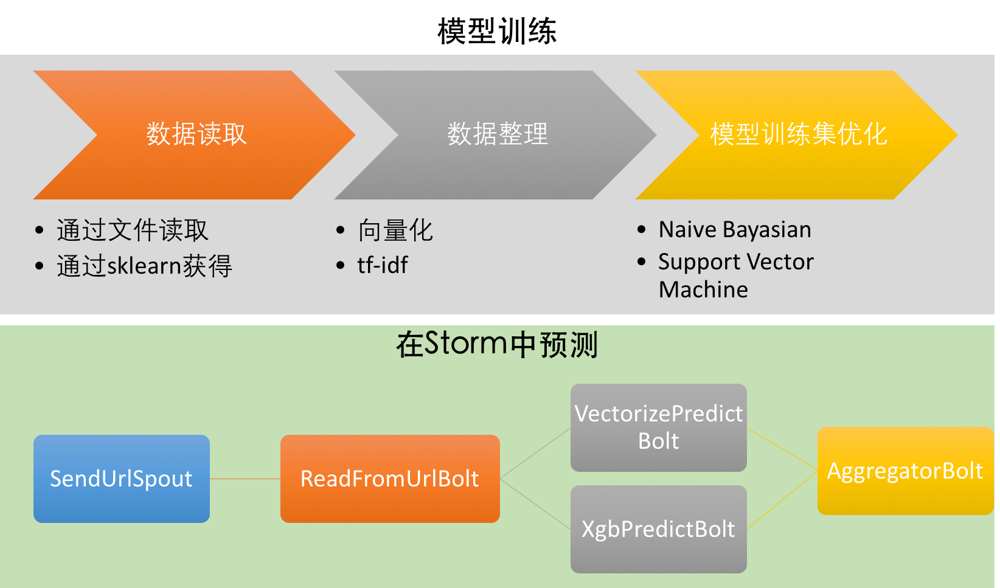
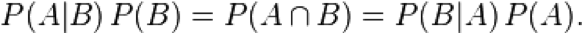
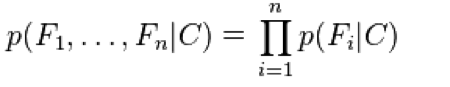
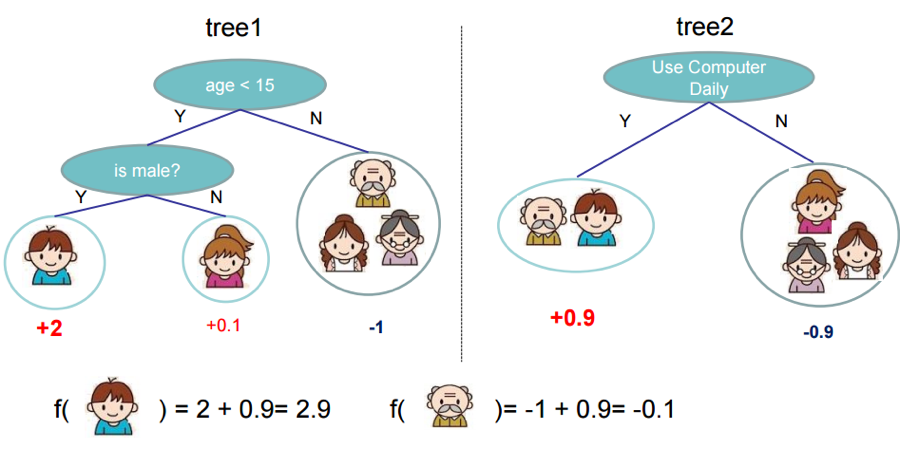
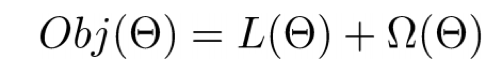
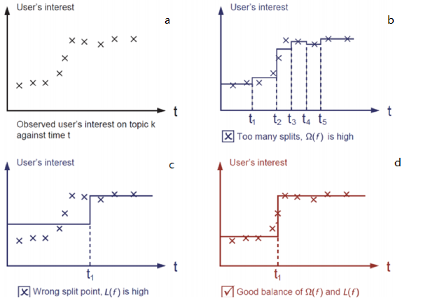
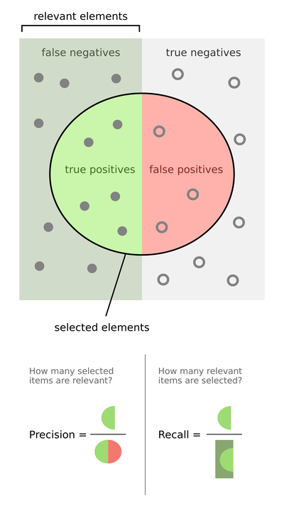
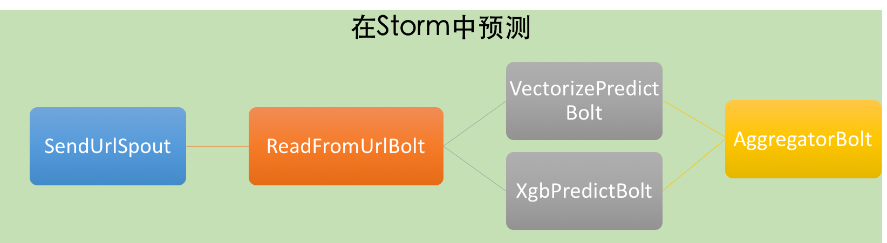

Week Four Task
====

Team Member: 顾炜，杨光

*All the codes and files (week 1 to 4) are avalaible at [github repo](https://github.com/4everer/stormTasks)*


**任务要求**
>任务描述：

>在任务3的基础上，实现新闻类网页的分类功能。训练数据和测试数据通过公众号下载。
要求是，分类器的训练模型可以使用非Storm技术，新网页的分类必须使用Storm技术。

>最终输出：

> 1. 形成《使用Storm实现新闻分词处理报告》（包含算法说明，程序运算准确率（即分类正确的网页个数/总网页个数），程序流程图，测试说明，结果介绍）
> 2. 使用Storm实现新闻分类程序源代码；

<br></br>
<br></br>

**目录**

1. [程序说明](#程序说明)
    1. [程序结构](#程序结构)
    2. [分类模型的建立](#分类模型的建立)
        1. [关于文本分类](#关于文本分类)
            1. [文本向量化](#文本向量化)
            2. [tf-idf](#tfidf)
        2. [模型介绍](#模型介绍)
            1. [Naive Bayesian](#naive-bayesian)
            2. [SVM](#svm)
            3. [xgboost](#xgboost)
        3. [代码说明](#代码说明)
            1. [数据读入](#数据读入)
            2. [数据整理](#数据整理)
            3. [模型训练](#模型训练)
            4. [简单评估](#简单评估)
            5. [xgboost](#xgboost-1)
    4. [storm topology](#storm-topology)
3. [结果介绍](#结果介绍)
    4. [模型训练和优化](#模型训练和优化)
        1. [关于数据集的优化](#关于数据集的优化)
        2. [模型参数的优化](#模型参数的优化)
            1. [grid search for SVM](#grid-search-for-svm)
            2. [xgboost优化](#xgboost优化)
    3. [对实际网页的测试](#对实际网页的测试)


<br></br>
<br></br>
<br></br>
<br></br>
<br></br>


____

提交的文件：

- storm代码
- 训练模型python代码(ipython notebook version): twentynews_train.ipynb
- 第四周项目说明(ipython notebook version): weekfour.ipynb
- 测试用url list: urlList.txt
- readme

文件结构
```
weekFour
├── newsClassification
│   ├── dependency-reduced-pom.xml
│   ├── multilang
│   │   └── resources
│   │       ├── __init__.py
│   │       ├── models.pickle
│   │       ├── splitsentence.py
│   │       ├── storm.py
│   │       ├── vectorize_predict.py
│   │       ├── xgb_model
│   │       └── xgb_predict.py
│   ├── pom.xml
│   ├── readme.md
│   └── src
│       └── main
│           └── com
│               ├── PageClassificationTopology.java
│               ├── bolts
│               │   ├── AggregateBolt.java
│               │   ├── ReadFromUrlBolt.java
│               │   ├── VectorizePredictBolt.java
│               │   └── XgbPredictBolt.java
│               └── spouts
│                   └── SendUrlSpout.java
├── readme.md
├── python_requirement.txt
├── twentynews_train.ipynb
├── urlList.txt
└── weekfour.ipynb
```

____

<br></br>
<br></br>
<br></br>
<br></br>
<br></br>
<br></br>
<br></br>
<br></br>
<br></br>
<br></br>
<br></br>


<a name="程序说明"></a>
# 程序说明

<a name="程序结构"></a>
## 程序结构



本周项目分为两部分： 分类模型训练部分和storm部分。

首先介绍文本分类的方法和使用的模型，然后是具体的代码

<a name="分类模型的建立"></a>
## 分类模型的建立
<a name="关于文本分类"></a>
### 关于文本分类

<a name="文本向量化"></a>
#### 文本向量化

为了对文字信息进行分析，我们需要将文本内容转化成数值特征，这一过程被称为文本向量化。一个比较直接的方法叫词袋（bag of words）：

1. 给所有文本中每一个特征词语分配一个整数编码，即编制一个从单词到整数的索引表。对于中文文本，这过程中就涉及到前几周任务中分词部分的实现
2. 进行词频统计，并记录在矩阵X中，其中X(i,j)

表示的含义为：在第i个文档中，编码为j的单词所出现的频数。

可以预见，上述的矩阵X会很大，假设训练集有10000篇文档，特征单词有100000，那么占用的内存空间就会达到10000 x 100000 x 4 bytes = 4GB。幸运的是，大部分X的元素一般会为0，因为大多数文档只会包含整个词库中的一小部分。所以X一般是一个稀疏矩阵，利用这一特征，scikit-learn使用scipy.sparse模块节省所需的存储资源和提高矩阵运算的效率。

<a name="tfidf"></a>
#### tfidf

在特征对向量化后文本进行分析的时候存在两个潜在问题

1. 较长的文档自然容易有更高的单词频数统计，尽管它们可能跟较短的文章讨论的是相同话题，这就给较长文章无意间加了较高的权重。 为了解决这一问题，可以频数除以该文档的总词数，得到的新特征tf（term frequency）
2. 一些词非常常见（例如，英文中的“the”，“a”，“is”），但却很少包含对文档分类有用的信息，因而如果直接将它们为给分类器，会掩盖那些出现次数少但却更有意义的单词。为此有必要进行IDF逆向文件频率（Inverse Document Frequency）修正。
  `IDFi = log(N/M)
  其中，N=文件总数，M=包含词条i的文档数。
  IDF基本思想是如果包含词条i的文档越少，也就是M越小，则说明词条t具有很好的类别区分能力，进而IDFi权重越大。这样便可以过滤掉常见的词语，保留重要的词语。


<a name="模型介绍"></a>
### 模型介绍
<a name="naive-bayesian"></a>
#### Naive Bayesian

Naive Bayes 方法基于贝叶斯条件概率：



当根据特征对样本进行分类时，利用如下公式：


其中：

- p(C|F1,...,Fn)表示当存在特征F1,…,Fn时，样本属于类别C的概率
- p(C)为C类别的概率，即在训练集中该分类的比率。
- p(F1,...,Fn|C)为C类别中存在F1,…Fn特征的概率。这里运用到了Naive Bayes方法中naïve的假设，及各项特征相互独立，因而有(P(Fi|C) 分别对应相应特征在训练集中的统计概率)：



- 分母即训练集中同时存在这些特征的概率，与类别无关，故而可以忽略。

<a name="svm"></a>
#### SVM

支持向量机的基本原理是通过构建超平面来区分训练集，分类优化的目标是数据点距离边界的距离尽可能远。支持向量机的支持向量指的就是与分类边界距离最近的训练资料点。从支持向量机的最佳化问题可以推导出一个重要性质：支持向量机的分类边界可由支持向量决定，而与其他资料点无关。这也是它们称为“支持向量”的原因。

考虑一个简单的示例。如下图，二维平面上有两类点，用一条直线可以将其分开。假设分类直线为aX+bY+c=0。


将数据点带入方程f(X,Y)=aX+bY+c，在上图的示例中，直线两侧的数据点，所对应的f函数值符号相反。将来对于待分类的数据，通过计算f函数值符号可以类别。

分类直线有多种可能(L1,L2,L3)，需要优化直线方程参数a,b,c来选取最优解。数据点到分类直线的距离d可以表达为 `f(X0, Y0)/(a^2 + b^2)^0.5`

假设d0为支持向量对应的距离，max(d0)所对应的直线即为所求。

<a name="xgboost"></a>
#### xgboost

Xgboost 是基于tree search的策略，并且整合多个较弱树模型得到一个准确率高得多的集合模型。比如下图所示，为了判断一个用户是否喜欢电脑游戏，就可以通过性别、日常习惯等多个角度分析。



最终的预测通过把两个树模型的结果相加。这样会比使用单独的判断策略准确率更高。
Xgboost方法的成本函数可以抽象为



其中第一部分称为training loss，它衡量最终模型多大程度上拟合训练集数据；第二部分则叫Regularization，它衡量最终模型的复杂度，以避免过度拟合的现象发生。



比如上图的示例用xgboost的方法拟合a中的数据；图b固然拟合效果好，但模型太复杂（Ω太高）；c模型简单，但拟合效果差（L太高）；而d则兼顾成本方程L和Ω两部分，为最优结果。

____

<a name="代码说明"></a>
###  代码说明
分类模型训练使用python编写，有数据读入，模型训练和优化，模型存储三部分。主要使用了第三方机器学习库[sklearn](http://scikit-learn.org/)，还增加了xgboost分类算法。

引用一张nltk的图说明一般文本处理的流程


**requirements**:

- sklearn
- xgboost
- matplotlib
- chardet


<a name="数据读入"></a>
#### 数据读入
可以使用sklearn提供的数据，得到的数据类型是`sklearn.datasets.base.Bunch`，是一个类似于字典的类型，其中文本存在`data`中，label存在`target`中，以数字标明，而分类的名称在`target_names`中

``` python
from sklearn.datasets import fetch_20newsgroups
from pprint import pprint

twenty_data = fetch_20newsgroups(shuffle=True, random_state=42)

all_categories = [twenty_data.target_names[t] for t in twenty_data.target]
for s in all_categories[:10]:
    print s

target_names = twenty_data.target_names
pprint(target_names)
```

输出:

```
['alt.atheism',
 'comp.graphics',
 'comp.os.ms-windows.misc',
 'comp.sys.ibm.pc.hardware',
 'comp.sys.mac.hardware',
 'comp.windows.x',
 'misc.forsale',
 'rec.autos',
 'rec.motorcycles',
 'rec.sport.baseball',
 'rec.sport.hockey',
 'sci.crypt',
 'sci.electronics',
 'sci.med',
 'sci.space',
 'soc.religion.christian',
 'talk.politics.guns',
 'talk.politics.mideast',
 'talk.politics.misc',
 'talk.religion.misc']
```


或者，从提供的数据文件读入。其中需要注意encoding，这里使用的chardet库来判断file的编码，以下是读入用到的function

``` python
from sklearn.datasets import load_files
from os import listdir
from os.path import isfile, join
import chardet

def load_data(datadir):

    for f in listdir(datadir):
        if isfile(join(datadir, f)):
            char_encoding = chardet.detect(f)["encoding"]
            break
        else:
            continue

    print "============================"
    print "read files from " + datadir
    print "file encoding is " + str(char_encoding)

    dataset = load_files(datadir, encoding=char_encoding, decode_error="ignore")

    return dataset
```

<a name="数据整理"></a>
#### 数据整理
训练数据和测试数据的建立非常重要，可以避免over fitting。真对NB和SVM，采用0.3的比例得到train和test两组数据。（以下使用sklearn提供的数据结构，与提供的数据文件内容是相同的）

``` python
from sklearn.cross_validation import train_test_split

twenty_train, twenty_test, y_train, y_test = train_test_split(
    twenty_data.data, twenty_data.target, test_size=0.3)
```

而针对文本数据，根据上问介绍的文本分类模型的方法，首先需要对数据进行分词计数，向量化，之后计算tf-idf，这样的得到的数据就可以用于模型训练了

```python
from sklearn.feature_extraction.text import CountVectorizer
from sklearn.feature_extraction.text import TfidfTransformer

count_vect = CountVectorizer()
train_counts = count_vect.fit_transform(twenty_train)
tfidf_transformer = TfidfTransformer()
train_tfidf = tfidf_transformer.fit_transform(train_counts)
```

<a name="模型训练"></a>
#### 模型训练
使用整理好的数据，就可以进行模型的训练了

``` python
from sklearn.naive_bayes import MultinomialNB
export_clf_nb = MultinomialNB().fit(train_tfidf, y_train)

from sklearn.linear_model import SGDClassifier
export_clf_svm = (SGDClassifier(loss='hinge', penalty='l2', alpha=1e-4, n_iter=5, random_state=42)
                    .fit(train_tfidf, y_train))
```

可以用下面这个简单的例子测试一下我们刚刚训练的模型


``` python
docs_new = ['God is love', 'OpenGL on the GPU is fast']
X_new_counts = count_vect.transform(docs_new)
X_new_tfidf = tfidf_transformer.transform(X_new_counts)

for model_name, clf in zip(["nb", "svm"], [export_clf_nb, export_clf_svm]):
    predicted_new = clf.predict(X_new_tfidf)

    for doc, category in zip(docs_new, predicted_new):
        print( model_name + ' predicts: %r => %s' % (doc, target_names[category]))
```

输出:

```
nb predicts: 'God is love' => soc.religion.christian
nb predicts: 'OpenGL on the GPU is fast' => rec.autos
svm predicts: 'God is love' => soc.religion.christian
svm predicts: 'OpenGL on the GPU is fast' => rec.autos
```

以上过程，最简明清晰可以采用Pipeline的形式，NB和SVM的训练如下：

``` python
from sklearn.pipeline import Pipeline
from sklearn.feature_extraction.text import CountVectorizer
from sklearn.feature_extraction.text import TfidfTransformer
from sklearn.naive_bayes import MultinomialNB
from sklearn.linear_model import SGDClassifier

def pipeline_train_classifier(classifier, x_train, y_train):
    if classifier == "nb":
        text_clf_nb = Pipeline([('vect', CountVectorizer()),
                             ('tfidf', TfidfTransformer()),
                             ('clf', MultinomialNB()),
                            ])
        return text_clf_nb.fit(x_train, y_train)
    elif classifier == "svm":
        text_clf_svm = Pipeline([('vect', CountVectorizer()),
                                 ('tfidf', TfidfTransformer()),
                                 ('clf_svm', SGDClassifier(loss='hinge', penalty='l2',
                                                  alpha=1e-4, n_iter=5, random_state=42))
                                ])
        return text_clf_svm.fit(x_train, y_train)
```

<a name="简单评估"></a>
#### 简单评估
利用`sklearn.metrics.classsification_report`函数和之前的到的测试集，可以简单地评估模型的质量，包括准确率，召回率和F1。

**准确率和召回率**
>准确率和召回率是广泛用于信息检索和统计学分类领域的两个度量值，用来评价结果的质量。其中精度是检索出相关文档数与检索出的文档总数的比率，衡量的是检索系统的查准率；召回率是指检索出的相关文档数和文档库中所有的相关文档数的比率，衡量的是检索系统的查全率。

>一般来说，Precision就是检索出来的条目（比如：文档、网页等）有多少是准确的，Recall就是所有准确的条目有多少被检索出来了。

准确率、召回率和 F 值是在鱼龙混杂的环境中，选出目标的重要评价指标。不妨看看这些指标的定义先：

- 准确率 = 提取出的正确信息条数 /  提取出的信息条数
- 召回率 = 提取出的正确信息条数 /  样本中的信息条数

两者取值在0和1之间，数值越接近1，查准率或查全率就越高。从下图可以看的更清楚，理解更明白



>当然希望检索结果Precision越高越好，同时Recall也越高越好，但事实上这两者在某些情况下有矛盾的。比如极端情况下，我们只搜索出了一个结果，且是准确的，那么Precision就是100%，但是Recall就很低；而如果我们把所有结果都返回，那么比如Recall是100%，但是Precision就会很低。因此在不同的场合中需要自己判断希望Precision比较高或是Recall比较高。如果是做实验研究，可以绘制Precision-Recall曲线来帮助分析

**综合评价指标(F-Measure)**

P和R指标有时候会出现的矛盾的情况，这样就需要综合考虑他们，最常见的方法就是F-Measure（又称为F-Score）。

F-Measure是Precision和Recall加权调和平均：


当参数α=1时，就是最常见的F1，也即


可知F1综合了P和R的结果，当F1较高时则能说明试验方法比较有效。

本部分引用了[推荐系统评测指标—准确率(Precision)、召回率(Recall)、F值(F-Measure)](http://bookshadow.com/weblog/2014/06/10/precision-recall-f-measure/)

<br></br>

下面是模型在测试数据集上得到的结果和相应的代码

``` python
from sklearn import metrics

def classifier_metrics(clf, x_test, y_test, target_names=None):
    predict = clf.predict(x_test)
    return metrics.classification_report(y_test, predict, target_names=target_names)

x_test = tfidf_transformer.transform(count_vect.transform(twenty_test))
for clf in [export_clf_nb, export_clf_svm]:
    print classifier_metrics(clf, x_test, y_test, target_names=target_names)
```

输出，得到了按类别统计的三项数据

```
precision    recall  f1-score   support

             alt.atheism       0.83      0.72      0.77       133
           comp.graphics       0.90      0.71      0.79       183
 comp.os.ms-windows.misc       0.84      0.89      0.86       172
comp.sys.ibm.pc.hardware       0.76      0.80      0.78       184
   comp.sys.mac.hardware       0.92      0.80      0.86       186
          comp.windows.x       0.94      0.81      0.87       197
            misc.forsale       0.93      0.62      0.74       194
               rec.autos       0.87      0.87      0.87       184
         rec.motorcycles       0.93      0.97      0.95       179
      rec.sport.baseball       0.96      0.93      0.94       185
        rec.sport.hockey       0.90      0.98      0.94       184
               sci.crypt       0.58      0.98      0.73       165
         sci.electronics       0.83      0.76      0.80       165
                 sci.med       0.97      0.89      0.93       166
               sci.space       0.86      0.95      0.91       167
  soc.religion.christian       0.54      0.98      0.69       178
      talk.politics.guns       0.78      0.97      0.86       157
   talk.politics.mideast       0.95      0.99      0.97       157
      talk.politics.misc       1.00      0.52      0.68       149
      talk.religion.misc       1.00      0.13      0.23       110

             avg / total       0.86      0.83      0.82      3395

                          precision    recall  f1-score   support

             alt.atheism       0.89      0.93      0.91       133
           comp.graphics       0.81      0.87      0.84       183
 comp.os.ms-windows.misc       0.85      0.91      0.88       172
comp.sys.ibm.pc.hardware       0.87      0.77      0.82       184
   comp.sys.mac.hardware       0.90      0.90      0.90       186
          comp.windows.x       0.91      0.89      0.90       197
            misc.forsale       0.84      0.87      0.86       194
               rec.autos       0.90      0.89      0.89       184
         rec.motorcycles       0.95      0.97      0.96       179
      rec.sport.baseball       0.96      0.96      0.96       185
        rec.sport.hockey       0.95      0.97      0.96       184
               sci.crypt       0.98      0.95      0.97       165
         sci.electronics       0.82      0.85      0.84       165
                 sci.med       0.96      0.94      0.95       166
               sci.space       0.96      0.97      0.96       167
  soc.religion.christian       0.92      0.95      0.94       178
      talk.politics.guns       0.95      0.97      0.96       157
   talk.politics.mideast       0.99      0.97      0.98       157
      talk.politics.misc       0.99      0.90      0.94       149
      talk.religion.misc       0.90      0.75      0.82       110

             avg / total       0.91      0.91      0.91      3395
```

模型在经过优化之后就可以储存了（优化过程见后文，结果介绍部分），使用`pickle`来dump需要用到的变量。 使用时只需再用`pickle` load即可。

``` python
import pickle

with open('export.pickle', 'wb') as f:
    pickle.dump([count_vect, tfidf_transformer, target_names, [export_clf_nb, export_clf_svm]], f)
```

<a name="xgboost-1"></a>
#### xgboost
本周项目还简单测试了xgboost模型。


``` python
import xgboost as xgb

dtrain = xgb.DMatrix(train_tfidf, label=y_train)
dtest = xgb.DMatrix(x_test, label=y_test)

param = {
    'num_class':20,
    'silent':0,
    'objective':'multi:softprob',
    'seed':42
    }

param['max_depth'] = 5
param['nthread'] = 4
param['learning_rate'] = 0.3
param['n_estimators'] = 1000
param['min_child_weight'] = 2
param['subsample'] = 0.8
param['eta'] = 1
param['gamma'] = 0.5
param['colsample_bytree'] = 0.8

evallist  = [(dtest,'eval'), (dtrain,'train')]
num_round = 10
plst = param.items()
```

``` python
num_round = 10
plst = param.items()
bst = xgb.train(plst, dtrain, num_round, evallist)
```

输出结果

```
[0] eval-merror:0.392931    train-merror:0.346003
[1] eval-merror:0.335788    train-merror:0.268089
[2] eval-merror:0.303976    train-merror:0.231974
[3] eval-merror:0.289249    train-merror:0.205834
[4] eval-merror:0.273638    train-merror:0.185756
[5] eval-merror:0.264507    train-merror:0.169971
[6] eval-merror:0.258910    train-merror:0.155701
[7] eval-merror:0.253314    train-merror:0.147115
[8] eval-merror:0.249485    train-merror:0.133603
[9] eval-merror:0.245655    train-merror:0.126657

```

最终模型也用pickle保存。

<br></br>

____

<a name="storm-topology"></a>
## storm topology



本次topology的功能是分析读取输入的一系列网址，逐个发送网址到读取url的bolt，然后获得网页内容，利用已经建立好的模型进行分类，最终汇总，输出结果。共有以下几个组件：

- `SendUrlSpout`
    在本项目中，读取还有网址的文件，然后逐行按条发送。
- `ReadFromUrlBolt`
    使用第三周的代码，接收网址的数据流，然后发出http请求，得到html源代码，解析后输出网页的标题和文字内容。
- `SklearnPredictBolt`
    读取已经训练好模型(来自sklearn)，对网页文字进行处理，然后利用模型预测分类。
- `XgbPredict`
    主要用于展示扩展性，可以在原有的模型之外，插入新的模型，进行预测。过程同样是读取训练好模型（不同的模型），对文字进行处理，最后预测分类，输出结果。
- `Aggregator`
    集中所有预测的分类，整合以待下一步处理。使用了`fieldsGrouping`按照`url`或是`title`作为key，将结果放在同一bolt汇总。 在本周的项目中，预测的结果在这一步的cleanup方法中输出到console和文件。

<a name="结果介绍"></a>
# 结果介绍
<a name="模型训练和优化"></a>
## 模型训练和优化
前文简单介绍了模型的训练和测试结果，而在实际运用中，需要很多的优化，包括参数的选择，特征的构造和选择等等。在不断追求更好结果的同时，也需要注意防止过拟合的发生。

<a name="关于数据集的优化"></a>
### 关于数据集的优化
任意打开数据集中的一篇文章，我们就会发现，其中包含了大量的元数据，比如这一篇

```
From: lerxst@wam.umd.edu (where's my thing)
Subject: WHAT car is this!?
Nntp-Posting-Host: rac3.wam.umd.edu
Organization: University of Maryland, College Park
Lines: 15

I was wondering if anyone out there could enlighten me on this car I saw
the other day. It was a 2-door sports car, looked to be from the late 60s/
early 70s. It was called a Bricklin. The doors were really small. In addition,
the front bumper was separate from the rest of the body. This is
all I know. If anyone can tellme a model name, engine specs, years
of production, where this car is made, history, or whatever info you
have on this funky looking car, please e-mail.

Thanks,
- IL
   ---- brought to you by your neighborhood Lerxst ----
```

除了正文之外，有发信人，组织，行数等事实上相关性较小的信息，删去之后会提高模型在预测新的数据，比如网页新闻的准确性。

所以在读取数据时进行以下处理，可以减少过拟合。

``` python
twenty_data = fetch_20newsgroups(remove=('headers', 'footers', 'quotes'), shuffle=True, random_state=42)
```

<a name="模型参数的优化"></a>
### 模型参数的优化
事实上，要优化模型，应当将数据集分为三部分，**train**，**cross validation**和**test**。训练集用来训练模型，cross validation部分用来测试不同参数组合的预测效果，最终在测试数据集上检验模型的质量，这同样是为了避免过拟合。

在本项目中，使用了sklearn和xgboost自带的cross validation。下面是SVM模型参数调试部分的过程，使用了`GridSearchCV`方法。

<a name="grid-search-for-svm"></a>
#### grid search for SVM

``` python
from __future__ import print_function

from pprint import pprint
from time import time
import logging

from sklearn.grid_search import GridSearchCV

## 参数范围的设置
parameters = {
    'vect__max_df': (0.5, 0.75, 1.0),
    #'vect__max_features': (None, 5000, 10000, 50000),
    'vect__ngram_range': ((1, 1), (1, 2)),  # unigrams or bigrams
    #'tfidf__use_idf': (True, False),
    #'tfidf__norm': ('l1', 'l2'),
    'clf__alpha': (0.001, 0.0001, 0.00001, 0.000001),
    'clf__penalty': ('l2', 'elasticnet'),
    #'clf__n_iter': (10, 50, 80),
}

pipeline = Pipeline([
    ('vect', CountVectorizer()),
    ('tfidf', TfidfTransformer()),
    ('clf', SGDClassifier()),
])

## 数据读取，也使用了不含元数据的训练集
data = fetch_20newsgroups(subset='train')
data_no_meta = fetch_20newsgroups(subset='train', remove=('headers', 'footers', 'quotes'))

grid_search = GridSearchCV(pipeline, parameters, n_jobs=-1, verbose=1)

def gridSearch(data, name):
    print("Performing grid search for " + name)
    print("pipeline:", [name for name, _ in pipeline.steps])
    print("parameters:")
    pprint(parameters)
    t0 = time()
    grid_search.fit(data.data, data.target)
    print("done in %0.3fs" % (time() - t0))
    print()

    print("Best score: %0.3f" % grid_search.best_score_)
    print("Best parameters set:")
    best_parameters = grid_search.best_estimator_.get_params()
    for param_name in sorted(parameters.keys()):
        print("\t%s: %r" % (param_name, best_parameters[param_name]))


gridSearch(data, "data with meta")
print("=============")
gridSearch(data_no_meta, "data without meta")
```

得到的结果如下，这样就可以使用优化过的参数进行预测了

```
Performing grid search for data with meta
pipeline: ['vect', 'tfidf', 'clf']
parameters:
{'clf__alpha': (0.001, 0.0001, 1e-05, 1e-06),
 'clf__penalty': ('l2', 'elasticnet'),
 'vect__max_df': (0.5, 0.75, 1.0),
 'vect__ngram_range': ((1, 1), (1, 2))}
Fitting 3 folds for each of 48 candidates, totalling 144 fits
[Parallel(n_jobs=-1)]: Done  42 tasks      | elapsed:  5.0min
[Parallel(n_jobs=-1)]: Done 144 out of 144 | elapsed: 18.6min finished
done in 1142.334s

Best score: 0.922
Best parameters set:
    clf__alpha: 0.0001
    clf__penalty: 'l2'
    vect__max_df: 1.0
    vect__ngram_range: (1, 2)

=============

Performing grid search for data without meta
pipeline: ['vect', 'tfidf', 'clf']
parameters:
{'clf__alpha': (0.001, 0.0001, 1e-05, 1e-06),
 'clf__penalty': ('l2', 'elasticnet'),
 'vect__max_df': (0.5, 0.75, 1.0),
 'vect__ngram_range': ((1, 1), (1, 2))}
Fitting 3 folds for each of 48 candidates, totalling 144 fits
[Parallel(n_jobs=-1)]: Done  42 tasks      | elapsed:  3.8min
[Parallel(n_jobs=-1)]: Done 144 out of 144 | elapsed: 13.0min finished
done in 802.951s

Best score: 0.752
Best parameters set:
    clf__alpha: 0.0001
    clf__penalty: 'l2'
    vect__max_df: 0.5
    vect__ngram_range: (1, 2)
```

<a name="xgboost优化"></a>
#### xgboost优化
由于篇幅原因以及xgboost在测试中表现并不好，应该是优化不到位，模型没有建立好，所以优化过程就不介绍了。但原理上仍然是cross validation，固定大部分参数，然后测试找到一个参数的最优，再固定优化好的，测试剩余的。

<a name="对实际网页的测试"></a>
## 对实际网页的测试
简单选取了一些网页如下

**sample list**

1. http://www.bbc.co.uk/sport/baseball/34696371
2. http://www.bbc.co.uk/news/uk-politics-36038672
3. http://www.bbc.co.uk/news/world-us-canada-36020165
4. http://www.techradar.com/news/computing/pc/should-the-enterprise-consider-the-apple-mac-again--1318114
5. http://www.techradar.com/news/computing/pc/what-to-do-with-your-old-windows-xp-pc-1232642


简单地人工判断，类别大致应当是：

1. sport.baseball
2. politics
3. politics/science/medicine
4. computer.mac
5. computer.pc

得到了下面的预测结果，依次是SVM， Naive Bayesian和Xgboost的预测

1. World Series: Kansas City Royals beat New York Mets to win title - BBC Sport :
    - talk.politics.mideast|talk.politics.misc|sci.crypt|talk.politics.misc|rec.sport.baseball|rec.sport.baseball
    - soc.religion.christian

2. Lead EU referendum campaigns named - BBC News :
    - talk.politics.mideast
    - talk.politics.misc
    - misc.forsale

3. Zika virus 'scarier than thought' says US - BBC News :
    - talk.politics.mideast
    - talk.politics.misc|sci.crypt|talk.politics.misc ## misc.forsale

4. Should the enterprise consider the Apple Mac again? | TechRadar :
    - comp.os.ms-windows.misc
    - comp.sys.mac.hardware
    - misc.forsale

4. 8 uses for your old Windows XP PC | TechRadar :
    - sci.crypt
    - comp.os.ms-windows.misc
    - rec.sport.baseball

可以看到SVM取得了很好的结果，Bayasian相对快速，也取得了不错的结果，然后未经完全优化的xgboost却表现不佳，也说明了理论上更好的模型如果未经完全优化和调试，预测的结果也难以让人满意。

<br></br>

*参考资料*

- [Working With Text Data](http://scikit-learn.org/stable/tutorial/text_analytics/working_with_text_data.html)
- [Awesome XGBoost](https://github.com/dmlc/xgboost/tree/master/demo)
- [Introduction to Boosted Trees](http://homes.cs.washington.edu/~tqchen/pdf/BoostedTree.pdf)
- [Gradient boosting](https://www.wikiwand.com/en/Gradient_boosting)
- [http://bookshadow.com/weblog/2014/06/10/precision-recall-f-measure/](http://bookshadow.com/weblog/2014/06/10/precision-recall-f-measure/)
