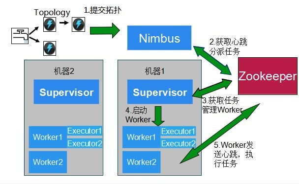
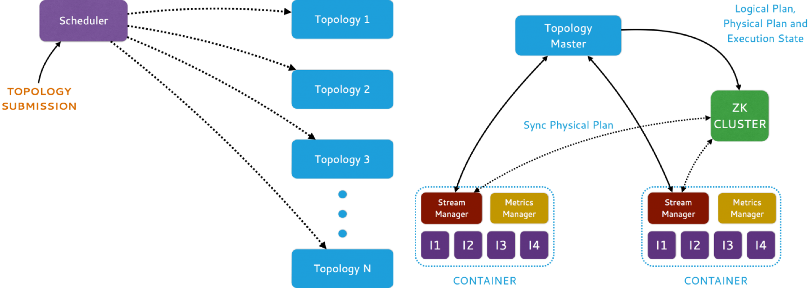
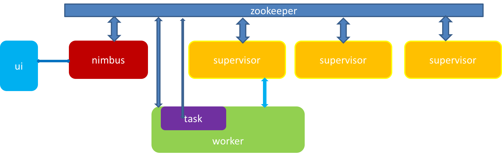
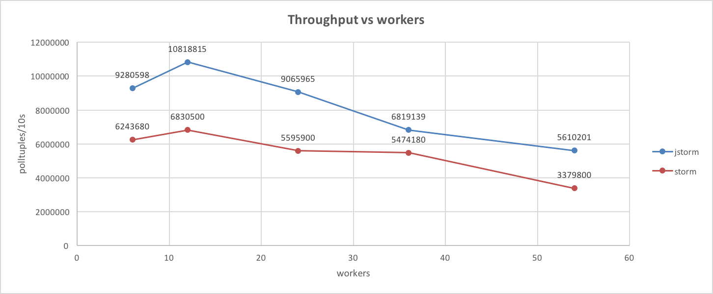

storm研究报告
====

Team member: 顾炜 杨光

____


# Storm简介


## 什么是Storm

Storm，即Apache Storm，是一个开源的分布式实时计算系统，大部分由Closure写成。 Storm最早由Nathan Marz在Backtype的团队开发。 在被twitter收购后，项目开源，在2011年9月17日发布。

## Storm的诞生
在Storm开发之前，数据处理方面的技术发展非常快: MapReduce，Hadoop等相关的技术使得存储，处理和计算大量的数据变成现实，而这一点是从前让人难以想象的。 这些数据处理工具的出现极大程度上帮助里人们处理所谓的大数据。 然而这些数据处理的工具并不是实时的，而且这些工具开发之初也并非为实时处理数据的目的而开发。 根本地讲，实时数据处理和大规模数据批处理的需求是不同的，把hadoop硬生生改造是不经济的。

然而，对很多行业来说，针对特大量数据的实时处理查询的需求已经变得越来越迫切，“实时hadoop”的呼声越来越高。为了完成这样的需求，在Storm之前，人们必须手工建立队列和工作单位的系统来进行实时计算。每个工作单位需要处理队列中的消息，完成数据库的更行，以及完成与其他工作单位的通信。这样的工作模型开发十分耗时往往消耗在与实时处理不相关的功能上），单个工作单位出错会影响全局，而且难以扩展应用到新的数据上。
尽管如此，这样消息队列加上工作单位的模型将海量的数据分解为单个任务，似乎指明了海量数据处理的方向，但是难以扩展和容错性低等缺陷仍然严重限制着生产力。

在这种情况下Storm诞生了，满足了实时处理的需求，同时简单易用，扩展性好，容错性高。

## Storm的组件
简单地讲，Storm集群和Hadoop集群非常相似：在Hadoop集群上运行`MapReduce jobs`，而在Storm集群上运行`topologies`。 但这两者本质上是不同的，首先一个不同点就是`MapReduce job`最终会运行完成，而`topologies`会在用户中止前持续运行，处理消息。

接下来我们来具体看看Storm的组件。


如上图，Storm有两类节点，主控节点(master node)和工作节点(worker node)。 主控节点上运行着`Nimbus`，类似于Hadoop中的JobTracker，它负责将代码和处理计算的任务分配给节点，同时监控错误。每个运行Storm的机器上都会有一个`Supervisor`的进程。`Supervisor`会听从`Nimbus`的调派，根据需要开启或结束工作进程。

回顾前文提到的海量数据的分布式处理，在Storm中，每个工作节点将处理`topology`整个任务的一部分，而运行中的`topology`可以有很多分布于不同机器的工作单位组成并且完成数据的计算和处理。

而`Nimbus`和`Supervisor`们之间的协调和处理都通过`Zookeeper`集群完成。而且这两者本身并不记录状态；所有`Nimbus`和`Supervisor`的状态都由`Zookeeper`集群记录在本地。同时`topology`一旦启动将持续运行直到认为停止。这样两个特性使得整个系统变得十分稳定。举个例子，就算若干`Nimbus`或`Supervisor`的进程被关闭或是崩溃，它们仍能被重启，并且不影响这个`topology`的工作，也不会丢失数据，这一点帮助解决了之前工具容错性低的问题。

下面这张示意图很好地总结了`Nimbus`，`Supervisor`和`Zookeeper`之间的关系，以及`topology`整个的工作。



## Stream
Storm的核心是流(stream)。在Storm中，流是无限的数组(unbounded tuples)。实际上，Storm主要是对流的分布式，可靠性强的处理和计算，输出结果或者新的流。比如说，可以把实时微博的流处理称为热点话题的流。`Topology`通过`spout`和`bolt`控制完成这样的流的处理和变化。开发人员根据需要编写`spouts`和`bolts`的逻辑，从而满足需求。

具体地，`spout`指发出流的节点，通常会连接数据来源，例如接入API获取实时数据转换为流发出，也可以接入消息队列，将它们处理成流并发出。而`bolts`则是消费流，接入一个或多个流，可以做从运行function，过滤数组，到整合计算，合并流，更新数据库等工作，还可以输出处理后的流。复杂的数据计算处理通常会由多个`bolts`完成。


上图很好地展示了`toppology`中`spout`和`bolt`组成的网络，节点之间的有向线段指示流的防线，这样的网络和两类节点的代码实际上在体现了数据处理的逻辑和具体的方法。

## 两层抽象概念理解Storm
上文从，Nimbus-ZooKeeper-Supervisor和spouts-bolts，两个角度介绍了topology。

Nimbus-ZooKeeper-Supervisor说明了Storm的组件结构：Nimbus掌管代码和工作的分发，并且监控状态，全局只有一个；Supervisor管理单个机器资源；ZooKeeper则储存前两者状态，为Nimbus调配提供信息。

Spouts-bolts则概括了数据处理的逻辑层：Spout是发出Tuple(stream)的结点,Bolt可以订阅Spout或者Bolt发出的Tuple。开发者数据处理的代码以这两者为单位编写，最终打包提交。

## 简单的例子(来自storm教程)
一个简单的topology，可以看到里面定义了一个spout，用以产生分词的流和两个bolt，进行两步处理，shuffle的方法指明了数据group的方式

``` java
TopologyBuilder builder = new TopologyBuilder();
builder.setSpout("words", new TestWordSpout(), 10);
builder.setBolt("exclaim1", new ExclamationBolt(), 3)
        .shuffleGrouping("words");
builder.setBolt("exclaim2", new ExclamationBolt(), 2)
        .shuffleGrouping("exclaim1");
```

spout的核心是`nextTuple`方法，表明了tuple(流)产生的方式，如下示例：

``` java
public void nextTuple() {
    Utils.sleep(100);
    final String[] words = new String[] {"nathan", "mike", "jackson", "golda", "bertels"};
    final Random rand = new Random();
    final String word = words[rand.nextInt(words.length)];
    _collector.emit(new Values(word));
}
```

bolt是处理数据的节点，代码包含处理的逻辑，主要有`prepare`, `excute`, `declareOutputFields`等方法，下面例子给tuple加上了"!!!"。这里`cleanup`多用于本地调试模式。

``` java
public static class ExclamationBolt implements IRichBolt {
    OutputCollector _collector;

    @Override
    public void prepare(Map conf, TopologyContext context, OutputCollector collector) {
        _collector = collector;
    }

    @Override
    public void execute(Tuple tuple) {
        _collector.emit(tuple, new Values(tuple.getString(0) + "!!!"));
        _collector.ack(tuple);
    }

    @Override
    public void cleanup() {
    }

    @Override
    public void declareOutputFields(OutputFieldsDeclarer declarer) {
        declarer.declare(new Fields("word"));
    }

    @Override
    public Map getComponentConfiguration() {
        return null;
    }
}
```


# 为什么用Storm
Storm为处理实时数据而生，正如MapReduce极大地方便了并行计算，Storm使得实时并行计算变得简单方便，具有重要的意义，尤其是解决了之前处理实时数据的痛点的以下优点：

- **应用范围广**：Storm可以处理实时消息并更新数据库，在应用中能完成对数据的连续查询，并行计算，并持续输出结果，具有极广的实用性。
- **扩展性**： Storm的扩展简单快速，只要增加新的机器，就可以拓展topology，这正是因为ZooKeeper保证了集群之间的协调和运转。
- **保证不会遗漏数据**：作为实时数据处理系统，保证每一条数据都被处理而不遗漏是必须的和根本的，Storm这一优点使之真正可以有效地用于生产环境。
- **容错性高**：计算的错误并不会影响整个集群，发生错误的任务会被重新分配。
- **鲁棒性好，对用户友好**：Storm简单易用，对于集群的管理简单方便，同时支持多种语言，节约了开发和维护的成本

# Storm的应用场景
Storm已经被广泛应用于不同领域，比如IT、金融、医疗、媒体等行业。总的来说有以下几个典型场景：

1.数据规范化与存档。比如Groupon应用Storm建立了一个实时的数据整合系统来清理并分类大量非特异数据点。IDEXX Laboratories利用Storm来从美国各地的兽医医疗记录里提取信息并转换存储到它们的Oracle RDBMS中。
2.统计分析。Twitter、Flipboard、Spotify等网站借助Storm分析个体用户行为和当前总体热点来优化推送流，搜索结果和广告定位。premise.is通过分析新兴市场的各类经济数据来引导对冲基金的投资选择。
3.事件日志监测分析。Yahoo!、淘宝、Navisite等用Storm分析事件日志来发掘有用信息。Spotify还运用Storm来追踪评估应用程序的性能表现。

# Storm的不同版本
## Storm的问题
Storm解决了随着时代发展，数据增长带来的问题和痛点，一经推出就获得了欢迎。正如上一部分提到的，Storm十分切合Twitter的需求，于是Twitter收购了Storm，并在2011年发布了第一个版本。然而随着数据类型和数据量的不断增长，原有Storm变得难以支持实时数据流处理系统带来的新的需求：每分钟十亿级别的数据处理，毫秒级延时，更容易理解的行为，容易debug和部署等。

有人列举了Storm具体的一些相关的瓶颈和问题如下，便于我们更好地理解为什么storm无法满足Twitter的需求

> - Storm assumes that every worker is homogeneous, which results in inefficient utilization of allocated resources, and often results in over-provisioning **效率问题**
> - Multiple levels of scheduling and their complex interaction leads to uncertainty about when tasks are being scheduled **行为不容易理解**
> - Each tuple has to pass through four (count ’em) threads in the worker process from the point of entry to the point of exit. This design leads to significant overhead and contention issues. **效率问题**
> - Nimbus is functionally overloaded and becomes an operational bottleneck. **效率问题**
> - Because of the large amount of memory allocated to workers, use of common profiling tools becomes very cumbersome. Dumps take so long that the heartbeats are missed and the supervisor kills the process (preventing the dump from completing). **不容易监控和调试**
> - ...

> *from [Twitter Heron: Stream Processing at Scale](http://blog.acolyer.org/2015/06/15/twitter-heron-stream-processing-at-scale/)*

实际上，面对相似量级甚至更多的数据和请求，阿里巴巴也面临着类似的情况和需求。一般地有如下的选择：
    － 扩展现有的Storm
    － 使用其他系统
    － 开发的新的系统
因为新的需求设计对Storm核心的改动，所以这个选项需要很长的周期，而其他可用的系统并不能很好地满足需求，所以Twitter和阿里都选择了开发新的系统，分别是Heron和JStorm。

## Heron--Twitter Storm
Twitter在开发Heron时主要集中在开发者效率，使管理集群变得荣和提升performance及其可预测性上。Heron的架构十分贴合Twitter对数据量和数据处理的需求。

下面来自Twitter Blog的两图展示了Heron整体的结构和Topology的构成。

我们可以看到Heron是一种容器式的架构，由scheduler完成任务的分配和资源的调度，从而从全局优化了资源的管理，提高了效率。在这些容器中至少有一个master容器，负责整个topology，而其余每个容器内运行着stream manager(负责数据流向(data rounting))，metric manager(负责收集运行情况)以及众多叫做Heron实例的线程，来运行用户提交的spout和bolt。在这其中ZooKeeper负责存储topology的集群信息和运行情况。

依托于这样的设计，Heron实现了以下特性:

- 抽象化出了scheduler，使得配置和扩展更容易
- 每个任务都运行在单独的线程和呈现丰富的UI使得debug更容易
- 向后兼容Storm API，迁移容易
- 容器式架构师的扩展容易，延迟降低
- 统一地调配任务和资源提高了效率

仍然借用Twitter自己的宣传图，展示效率的提高


## JStorm
JStorm是阿里用java重新编写实现的Storm，提供了更多的特性，更加稳定。

JStorm采用了类似Strom的结构，如下图



具体有以下改进：

1. 新的参数监控
    - metrics API
    - 新的UI展示信息，koala
2. 参考了Twitter关于Heron的paper，在此基础上优化了paper中的设计
3. 不同尺度的隔离带来调试的便宜和资源利用的效率提高
    - 集群的隔离(可通过koala配置)
    - 用户可控制的scheduler
4. 从nimbus独立出部分控制，解决瓶颈问题
5. 重新设计了ZooKeeper的使用
    - 移除动态数据的存储
    - 增加ZooKeeper支持的节点数
6. 容易安装和运行
7. 客户端优化增加易用性： API，metrics and etc

同样地，用一张来自阿里的图展示效率的提高



## 关于安全性的一点补充
Storm最初的设计并没有考虑安全性方面的问题，所以在目前的0.9.xx版本中存在着没有验证授权系统，数据也没有加密，ZooKeeper数据访问没有权限控制等问题，除了以上两个版本之外，Yahoo对Storm的fork也加入了一些安全方面的功能，弥补了Storm的缺憾。

**小结**

可以看到Heron和JStorm都在Storm的基础上做出了改进，提升了效率，易用使用。相比之下Heron更针对twitter本身的需求，从Strom的基础发展出很多，而JStorm则和Storm较为贴近，而新一版的Storm也会参考很多JStorm的部分。


<br></br>

*参考资料*

1. [Apache Storm tutorial 0.9.6](https://storm.apache.org/releases/0.9.6/Tutorial.html)
2. [Apache Storm concepts 0.10.0](https://storm.apache.org/releases/0.10.0/Concepts.html)
3. [Realtime Event Processing in Hadoop with Storm and Kafka](http://hortonworks.com/hadoop-tutorial/simulating-transporting-realtime-events-stream-apache-kafka/)
4. [Storm：最火的流式处理框架](http://tech.uc.cn/?p=2159)
5. [Companies Using Apache Storm](http://storm.apache.org/Powered-By.html)
6. [What are some of the use cases of Apache Storm?](https://www.quora.com/What-are-some-of-the-use-cases-of-Apache-Storm)
7. [Flying faster with Twitter Heron](https://blog.twitter.com/2015/flying-faster-with-twitter-heron)
8. [Twitter Heron: Stream Processing at Scale](http://blog.acolyer.org/2015/06/15/twitter-heron-stream-processing-at-scale/)
9. [Alibaba Jstorm on github](https://github.com/alibaba/jstorm)
10. [Apache Storm 0.9 basic training - Verisign](http://www.slideshare.net/miguno/apache-storm-09-basic-training-verisign)


