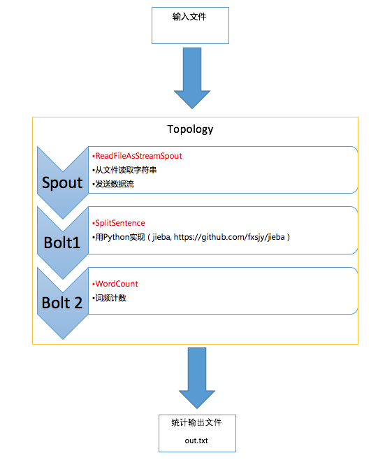
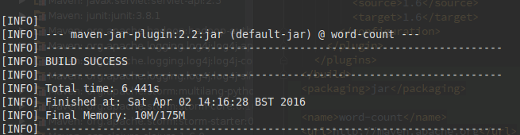
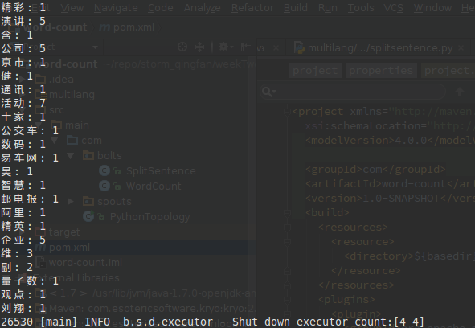
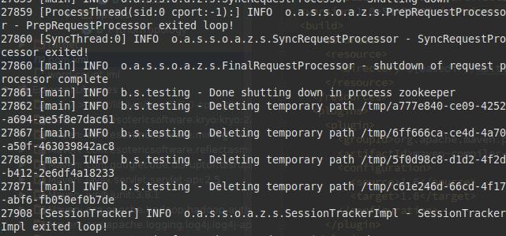

Storm词频统计程序
====

Team Member: 顾炜，杨光

**任务要求**

>1.形成《利用Storm词频统计程序报告》（包含程序说明，测试说明，结果介绍）

>2.Storm词频统计程序源代码

# 程序设计及说明

Topology如上图所示，由一个spout和两个bolt构成

`ReadFileAsStreamSpout`读入指定文件，按行生成stream
随后`SplitSentence`接受这个stream，用python处理分词，使用了jieba，之后生成word的stream
stream进入`WordCount`，进行计数，结果会在console显示，同时也输出文件

整个项目参考了storm官方的start中的[WordCountTopology](https://github.com/apache/storm/blob/master/examples/storm-starter/src/jvm/org/apache/storm/starter/WordCountTopology.java), 除了重构之外，重写了Spout，增加了读取文件的功能，分词方面使用python第三方lib：jieba

## 程序运行

### Maven安装和配置
Maven可以从官网获取[下载](http://maven.apache.org/download.cgi)，本项目搭建测试过程中使用了Maven 3.3.9版。

Maven的安装参考[官方说明](http://maven.apache.org/install.html)。

1. 须事先确认JDK已经安装，并且环境变量JAVA_HOME指向JDK安装路径。
2. 解压下载文件 `“tar -xzvf apache-maven-3.3.9-bin.tar.gz”`。
3. 为了方便Maven使用，将安装路径加入PATH变量：`sudo gedit /etc/profile`, 添加`export PATH=$PATH: /opt/apache-maven-3.3.9/bin` (Maven bin文件夹路径取决于用户选择)。
4. 重启系统并验证Maven安装 `mvn -v`

## 用Maven建立项目

整个程序使用Maven建立，添加了`storm-core`和`multilang-python`的依赖，对src和resources进行配置定义以及添加Maven的源之后，即可从下载以来，建立项目。

## 程序运行

to run the demo, make sure you have python installed, then use `pip install jieba` to install [jieba](https://github.com/fxsjy/jieba)

direct into the word-count dir, first build the jar with Maven

`mvn package`

then

`$Storm_Home_Dir/bin/storm jar target/word-count-1.0-SNAPSHOT.jar PythonTopology ../testInput.txt`

Here is parts of result printed in console

Here is the screensnap for the end of the run

The result will be also available in output.txt

# 结果介绍

得到的结果包括在了提交的文件当中，同时利用计数的结果，制作了下面的word cloud

发现分词的效果有待优化，例如“大数”应该是“大数据”等，不过还是能够明显地看出整篇文档的核心词汇
